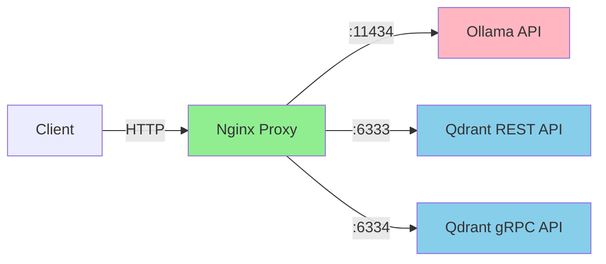
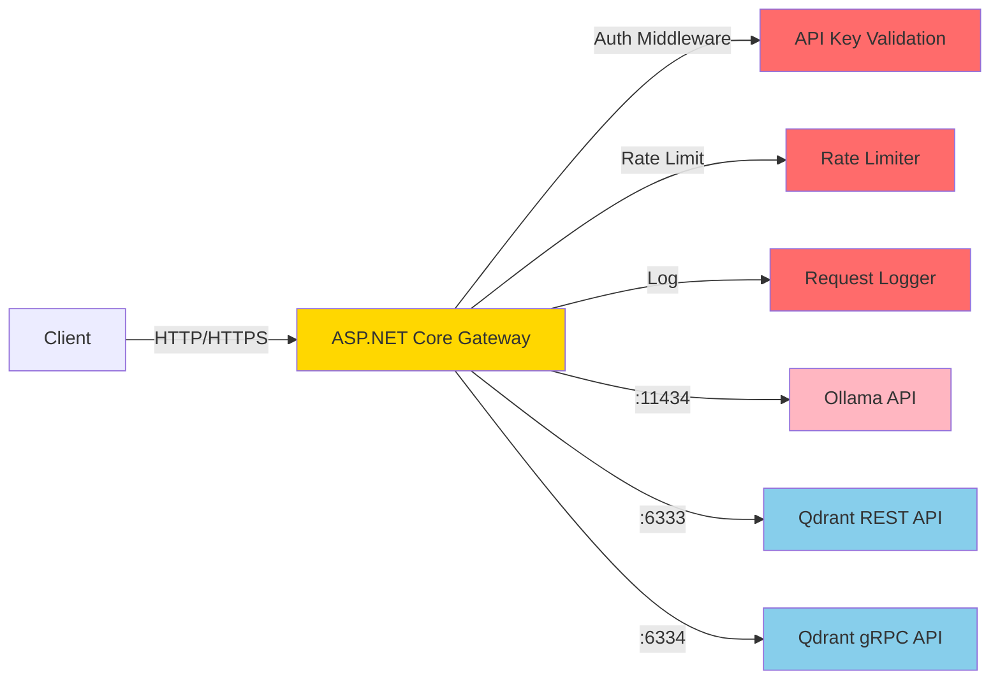
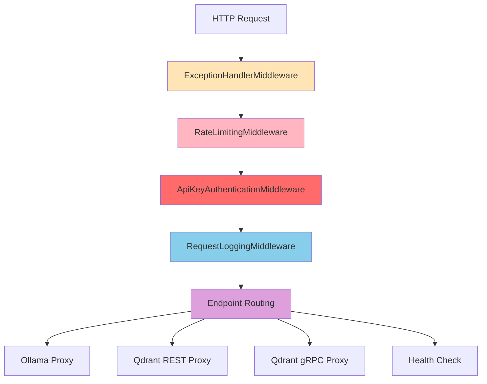

# ASP.NET Core 8.0 Gateway Architecture Document

## Overview

Данный документ описывает архитектуру ASP.NET Core 8.0 API Gateway, который заменяет Nginx в качестве единой точки входа для стека Ollama + Qdrant. Gateway обеспечивает аутентификацию, логирование, rate limiting и проксирование запросов к backend-сервисам.

---

## 1. Current vs Target Architecture

### 1.1 Current Architecture



**Проблемы текущей архитектуры:**
- Нет аутентификации/авторизации
- Нет rate limiting
- Нет централизованного логирования запросов
- Нет health check endpoints
- Статическая конфигурация nginx

### 1.2 Target Architecture



---

## 2. Project Structure

```
aspnet-gateway/
├── src/
│   ├── Gateway.Api/                    # Web API project (entry point)
│   │   ├── Program.cs                  # Application entry point, DI setup
│   │   ├── appsettings.json            # Default configuration
│   │   ├── appsettings.Development.json
│   │   ├── Properties/
│   │   │   └── launchSettings.json
│   │   └── Endpoints/
│   │       ├── OllamaEndpoints.cs      # Ollama proxy endpoints
│   │       ├── QdrantEndpoints.cs      # Qdrant REST proxy endpoints
│   │       └── HealthEndpoints.cs      # Health check endpoints
│   │
│   ├── Gateway.Core/                   # Core business logic
│   │   ├── Models/
│   │   │   ├── ApiKeyConfig.cs         # API key configuration model
│   │   │   ├── RateLimitConfig.cs      # Rate limit configuration
│   │   │   └── ServiceEndpoints.cs     # Upstream service URLs
│   │   ├── Interfaces/
│   │   │   ├── IApiKeyValidator.cs     # API key validation interface
│   │   │   ├── IProxyService.cs        # Proxy service interface
│   │   │   └── ILoggingService.cs      # Logging service interface
│   │   └── Services/
│   │       ├── ApiKeyValidator.cs      # API key validation implementation
│   │       ├── OllamaProxyService.cs   # Ollama proxy implementation
│   │       ├── QdrantProxyService.cs   # Qdrant REST proxy implementation
│   │       └── QdrantGrpcProxyService.cs # Qdrant gRPC proxy implementation
│   │
│   ├── Gateway.Infrastructure/         # Infrastructure layer
│   │   ├── Middleware/
│   │   │   ├── ApiKeyAuthenticationMiddleware.cs
│   │   │   ├── RequestLoggingMiddleware.cs
│   │   │   └── RateLimitingMiddleware.cs
│   │   ├── Extensions/
│   │   │   ├── ServiceCollectionExtensions.cs  # DI registration
│   │   │   └── WebApplicationExtensions.cs     # Middleware pipeline setup
│   │   └── HealthChecks/
│   │       ├── OllamaHealthCheck.cs
│   │       └── QdrantHealthCheck.cs
│   │
│   └── Gateway.Grpc/                   # gRPC client for Qdrant
│       ├── Protos/
│       │   └── qdrant.proto            # Qdrant gRPC proto definition
│       ├── Generated/                  # Auto-generated gRPC clients
│       └── Services/
│           └── QdrantGrpcClient.cs     # gRPC client wrapper
│
├── tests/
│   ├── Gateway.Tests/                  # Unit tests
│   └── Gateway.IntegrationTests/       # Integration tests
│
├── Dockerfile                          # Multi-stage Docker build
├── docker-compose.gateway.yml          # Gateway docker-compose override
├── .dockerignore
├── .gitignore
└── Gateway.sln                         # Solution file
```

---

## 3. Key Implementation Patterns

### 3.1 Middleware Pipeline

Порядок middleware критически важен для правильной обработки запросов:



#### 3.1.1 ApiKeyAuthenticationMiddleware

```csharp
public class ApiKeyAuthenticationMiddleware
{
    private readonly RequestDelegate _next;
    private readonly IApiKeyValidator _validator;
    private readonly ApiKeyConfig _config;

    public async Task InvokeAsync(HttpContext context)
    {
        // Skip auth for health check endpoints
        if (context.Request.Path.StartsWithSegments("/health"))
        {
            await _next(context);
            return;
        }

        // Extract API key from header
        if (!context.Request.Headers.TryGetValue("X-API-Key", out var apiKey) 
            || !_validator.IsValid(apiKey))
        {
            context.Response.StatusCode = StatusCodes.Status401Unauthorized;
            await context.Response.WriteAsJsonAsync(new { error = "Unauthorized" });
            return;
        }

        await _next(context);
    }
}
```

#### 3.1.2 RequestLoggingMiddleware

```csharp
public class RequestLoggingMiddleware
{
    private readonly RequestDelegate _next;
    private readonly ILogger<RequestLoggingMiddleware> _logger;

    public async Task InvokeAsync(HttpContext context)
    {
        var stopwatch = Stopwatch.StartNew();
        
        // Log request
        _logger.LogInformation(
            "Request {Method} {Path} started",
            context.Request.Method,
            context.Request.Path);

        // Capture response body for logging
        var originalBodyStream = context.Response.Body;
        using var responseBodyStream = new MemoryStream();
        context.Response.Body = responseBodyStream;

        try
        {
            await _next(context);
            stopwatch.Stop();

            // Log response
            _logger.LogInformation(
                "Request {Method} {Path} completed with status {StatusCode} in {ElapsedMs}ms",
                context.Request.Method,
                context.Request.Path,
                context.Response.StatusCode,
                stopwatch.ElapsedMilliseconds);
        }
        finally
        {
            context.Response.Body = originalBodyStream;
        }
    }
}
```

#### 3.1.3 RateLimitingMiddleware

Используем встроенный RateLimiter из .NET 8:

```csharp
// In Program.cs
builder.Services.AddRateLimiter(options =>
{
    options.GlobalLimiter = PartitionedRateLimiter.Create<HttpContext, string>(context =>
    {
        var apiKey = context.Request.Headers["X-API-Key"].ToString();
        return RateLimitPartition.GetFixedWindowLimiter(
            apiKey,
            _ => new FixedWindowRateLimiterOptions
            {
                PermitLimit = 100,
                Window = TimeSpan.FromMinutes(1)
            });
    });

    options.OnRejected = async (context, token) =>
    {
        context.HttpContext.Response.StatusCode = StatusCodes.Status429TooManyRequests;
        await context.HttpContext.Response.WriteAsJsonAsync(
            new { error = "Rate limit exceeded" }, token);
    };
});
```

### 3.2 HttpClient Configuration

```csharp
// Ollama HttpClient - optimized for streaming
builder.Services.AddHttpClient("Ollama", client =>
{
    client.BaseAddress = new Uri(configuration["Services:Ollama:BaseUrl"]);
    client.Timeout = TimeSpan.FromMinutes(5); // Long timeout for streaming
    client.DefaultRequestHeaders.Add("Accept", "text/event-stream");
})
.ConfigurePrimaryHttpMessageHandler(() => new SocketsHttpHandler
{
    PooledConnectionLifetime = TimeSpan.FromMinutes(5),
    EnableMultipleHttp2Connections = true,
    ResponseDrainTimeout = TimeSpan.FromSeconds(30)
});

// Qdrant REST HttpClient
builder.Services.AddHttpClient("Qdrant", client =>
{
    client.BaseAddress = new Uri(configuration["Services:Qdrant:BaseUrl"]);
    client.Timeout = TimeSpan.FromMinutes(2);
})
.ConfigurePrimaryHttpMessageHandler(() => new SocketsHttpHandler
{
    PooledConnectionLifetime = TimeSpan.FromMinutes(5),
    EnableMultipleHttp2Connections = true
});
```

### 3.3 Streaming Proxy for Ollama

Ollama использует Server-Sent Events (SSE) для streaming ответов. Критически важно правильно проксировать streaming:

```csharp
public static class OllamaEndpoints
{
    public static async Task ProxyOllamaRequest(
        HttpContext context,
        IHttpClientFactory httpClientFactory)
    {
        var client = httpClientFactory.CreateClient("Ollama");
        var path = context.Request.Path.Value;
        
        // Forward the request to Ollama
        using var request = CreateProxyRequest(context, path);
        
        using var response = await client.SendAsync(
            request, 
            HttpCompletionOption.ResponseHeadersRead); // Important for streaming!

        // Copy response headers
        context.Response.StatusCode = (int)response.StatusCode;
        foreach (var header in response.Content.Headers)
        {
            context.Response.Headers[header.Key] = header.Value.First();
        }

        // Stream response body directly to client
        await response.Content.CopyToAsync(context.Response.Body);
    }

    private static HttpRequestMessage CreateProxyRequest(HttpContext context, string path)
    {
        var uri = new UriBuilder(context.Request.Scheme, "ollama", 11434, path)
        {
            Query = context.Request.QueryString.Value
        };

        var request = new HttpRequestMessage(
            new HttpMethod(context.Request.Method), 
            uri.Uri);

        if (context.Request.Method == HttpMethods.Post)
        {
            request.Content = new StreamContent(context.Request.Body);
            request.Content.Headers.ContentType = 
                new MediaTypeHeaderValue("application/json");
        }

        return request;
    }
}
```

### 3.4 gRPC Proxy for Qdrant

Для gRPC проксирования используем YARP или прямой gRPC client:

```csharp
// gRPC Client Configuration
builder.Services.AddGrpcClient<QdrantGrpc.QdrantClient>(options =>
{
    options.Address = new Uri(configuration["Services:Qdrant:GrpcBaseUrl"]);
})
.ConfigureChannel(channel =>
{
    channel.HttpHandler = new SocketsHttpHandler
    {
        PooledConnectionLifetime = TimeSpan.FromMinutes(5),
        EnableMultipleHttp2Connections = true
    };
});

// gRPC Proxy Endpoint
public static class QdrantGrpcEndpoints
{
    public static async Task ProxyGrpcRequest(
        HttpContext context,
        QdrantGrpc.QdrantClient qdrantClient)
    {
        // For full gRPC proxy, use YARP with gRPC support
        // Or implement method-by-method proxying
        await context.Response.WriteAsJsonAsync(
            new { error = "gRPC proxy requires YARP configuration" });
    }
}
```

### 3.5 Health Check Endpoints

```csharp
// Health Check Registration
builder.Services.AddHealthChecks()
    .AddCheck<OllamaHealthCheck>("ollama")
    .AddCheck<QdrantHealthCheck>("qdrant");

// Health Check Implementation
public class OllamaHealthCheck : IHealthCheck
{
    private readonly IHttpClientFactory _httpClientFactory;

    public async Task<HealthCheckResult> CheckHealthAsync(
        HealthCheckContext context,
        CancellationToken cancellationToken = default)
    {
        try
        {
            var client = _httpClientFactory.CreateClient("Ollama");
            var response = await client.GetAsync("/api/tags", cancellationToken);
            
            return response.IsSuccessStatusCode
                ? HealthCheckResult.Healthy("Ollama is responding")
                : HealthCheckResult.Degraded("Ollama returned non-success status");
        }
        catch (Exception ex)
        {
            return HealthCheckResult.Unhealthy("Ollama is not reachable", ex);
        }
    }
}
```

---

## 4. Configuration Schema

### 4.1 appsettings.json

```json
{
  "Logging": {
    "LogLevel": {
      "Default": "Information",
      "Microsoft.AspNetCore": "Warning",
      "Gateway": "Debug"
    }
  },
  "AllowedHosts": "*",
  "Gateway": {
    "Port": 8080,
    "HttpsPort": 8443,
    "EnableHttps": false
  },
  "Authentication": {
    "ApiKey": {
      "Enabled": true,
      "Keys": [
        {
          "Key": "your-secret-api-key-here",
          "Name": "default",
          "Roles": ["admin"]
        },
        {
          "Key": "readonly-key-here",
          "Name": "readonly",
          "Roles": ["reader"]
        }
      ]
    }
  },
  "RateLimiting": {
    "Enabled": true,
    "Default": {
      "PermitLimit": 100,
      "WindowSeconds": 60
    },
    "PerKey": {
      "ollama/chat": {
        "PermitLimit": 10,
        "WindowSeconds": 60
      },
      "qdrant/search": {
        "PermitLimit": 50,
        "WindowSeconds": 60
      }
    }
  },
  "Services": {
    "Ollama": {
      "BaseUrl": "http://ollama:11434",
      "TimeoutSeconds": 300,
      "EnableStreaming": true
    },
    "Qdrant": {
      "BaseUrl": "http://qdrant:6333",
      "GrpcBaseUrl": "http://qdrant:6334",
      "TimeoutSeconds": 120
    }
  },
  "HealthChecks": {
    "Enabled": true,
    "IntervalSeconds": 30,
    "TimeoutSeconds": 10
  }
}
```

### 4.2 Environment Variables Override

| Environment Variable | Description | Default |
|---------------------|-------------|---------|
| `GATEWAY_PORT` | HTTP port | `8080` |
| `GATEWAY_HTTPS_PORT` | HTTPS port | `8443` |
| `GATEWAY_ENABLE_HTTPS` | Enable HTTPS | `false` |
| `AUTH_API_KEY` | Primary API key | - |
| `AUTH_API_KEY_READONLY` | Read-only API key | - |
| `RATE_LIMIT_ENABLED` | Enable rate limiting | `true` |
| `RATE_LIMIT_PER_MINUTE` | Default rate limit | `100` |
| `SERVICES_OLLAMA_BASE_URL` | Ollama service URL | `http://ollama:11434` |
| `SERVICES_QDRANT_BASE_URL` | Qdrant REST URL | `http://qdrant:6333` |
| `SERVICES_QDRANT_GRPC_URL` | Qdrant gRPC URL | `http://qdrant:6334` |
| `LOG_LEVEL` | Log level | `Information` |

---

## 5. Docker Integration

### 5.1 Dockerfile

```dockerfile
# Build stage
FROM mcr.microsoft.com/dotnet/sdk:8.0 AS build
WORKDIR /src

# Copy csproj and restore
COPY ["src/Gateway.Api/Gateway.Api.csproj", "src/Gateway.Api/"]
COPY ["src/Gateway.Core/Gateway.Core.csproj", "src/Gateway.Core/"]
COPY ["src/Gateway.Infrastructure/Gateway.Infrastructure.csproj", "src/Gateway.Infrastructure/"]
COPY ["src/Gateway.Grpc/Gateway.Grpc.csproj", "src/Gateway.Grpc/"]
RUN dotnet restore "src/Gateway.Api/Gateway.Api.csproj"

# Copy everything else and build
COPY . .
WORKDIR "/src/src/Gateway.Api"
RUN dotnet build -c Release -o /app/build

# Publish stage
FROM build AS publish
RUN dotnet publish -c Release -o /app/publish /p:UseAppHost=false

# Runtime stage
FROM mcr.microsoft.com/dotnet/aspnet:8.0 AS final
WORKDIR /app

# Create non-root user
RUN groupadd -r appuser && useradd -r -g appuser appuser

# Copy published app
COPY --from=publish /app/publish .

# Set ownership
RUN chown -R appuser:appuser /app
USER appuser

EXPOSE 8080
EXPOSE 8443

ENV ASPNETCORE_URLS=http://+:8080
ENV ASPNETCORE_ENVIRONMENT=Production

ENTRYPOINT ["dotnet", "Gateway.Api.dll"]
```

### 5.2 docker-compose.gateway.yml (Override)

```yaml
# docker-compose.gateway.yml
# Use with: docker-compose -f docker-compose.yml -f docker-compose.gateway.yml up -d

services:
  # Remove nginx from the stack
  nginx:
    profiles:
      - disabled  # This disables the nginx service

  # Add ASP.NET Core Gateway
  gateway:
    build:
      context: ../aspnet-gateway
      dockerfile: Dockerfile
    container_name: api-gateway
    ports:
      - "8080:8080"   # HTTP
      - "8443:8443"   # HTTPS (optional)
    environment:
      - ASPNETCORE_ENVIRONMENT=Production
      - AUTH_API_KEY=${GATEWAY_API_KEY:-your-secret-key-here}
      - SERVICES_OLLAMA_BASE_URL=http://ollama:11434
      - SERVICES_QDRANT_BASE_URL=http://qdrant:6333
      - SERVICES_QDRANT_GRPC_URL=http://qdrant:6334
      - RATE_LIMIT_ENABLED=true
      - RATE_LIMIT_PER_MINUTE=100
    networks:
      - internal
    depends_on:
      - ollama
      - qdrant
    restart: unless-stopped
    healthcheck:
      test: ["CMD", "curl", "-f", "http://localhost:8080/health"]
      interval: 30s
      timeout: 10s
      retries: 3
      start_period: 15s
```

### 5.3 Updated docker-compose.yml Integration

```yaml
# Modified docker-compose.yml with Gateway instead of Nginx

services:
  ollama:
    image: ollama/ollama:0.13.5
    container_name: ollama
    volumes:
      - ollama:/root/.ollama
    environment:
      - OLLAMA_HOST=0.0.0.0
      - OLLAMA_NUM_PARALLEL=1
      - OLLAMA_MAX_LOADED_MODELS=1
      - OLLAMA_GPU_LAYERS=0
      - OLLAMA_NUM_THREADS=4
      - OLLAMA_MAX_QUEUE=1024
      - OLLAMA_KEEP_ALIVE="2h"
      - OLLAMA_DEBUG=false
    networks:
      - internal
    restart: unless-stopped

  qdrant:
    image: qdrant/qdrant:v1.16.2
    container_name: qdrant
    volumes:
      - qdrant_storage:/qdrant/storage
      - ./qdrant/config.yaml:/qdrant/config/production.yaml:ro
    command: ./qdrant --config-path /qdrant/config/production.yaml
    environment:
      - QDRANT__STORAGE__STORAGE_PATH=/qdrant/storage
      - QDRANT__SERVICE__HTTP_PORT=6333
      - QDRANT__SERVICE__GRPC_PORT=6334
      - QDRANT__SERVICE__ENABLE_CORS=true
      - QDRANT__STORAGE__SNAPSHOTS_PATH=/qdrant/snapshots
      - QDRANT__TELEMETRY_DISABLED=true
    networks:
      - internal
    restart: unless-stopped

  # Gateway replaces Nginx
  gateway:
    build:
      context: ../aspnet-gateway
      dockerfile: Dockerfile
    container_name: api-gateway
    ports:
      - "8080:8080"   # Main entry point
      - "8443:8443"   # HTTPS (optional)
    environment:
      - ASPNETCORE_ENVIRONMENT=Production
      - AUTH_API_KEY=${GATEWAY_API_KEY:-change-me-in-production}
      - SERVICES_OLLAMA_BASE_URL=http://ollama:11434
      - SERVICES_QDRANT_BASE_URL=http://qdrant:6333
      - SERVICES_QDRANT_GRPC_URL=http://qdrant:6334
    networks:
      - internal
    depends_on:
      - ollama
      - qdrant
    restart: unless-stopped
    healthcheck:
      test: ["CMD", "curl", "-f", "http://localhost:8080/health"]
      interval: 30s
      timeout: 10s
      retries: 3
      start_period: 15s

volumes:
  ollama:
  qdrant_storage:

networks:
  internal:
    driver: bridge
```

---

## 6. API Endpoints Reference

### 6.1 Gateway Endpoints

| Method | Path | Description | Auth Required |
|--------|------|-------------|---------------|
| GET | `/health` | Health check (all services) | No |
| GET | `/health/ollama` | Ollama health check | No |
| GET | `/health/qdrant` | Qdrant health check | No |
| GET | `/ready` | Readiness probe | No |
| GET | `/metrics` | Prometheus metrics | Yes |

### 6.2 Proxied Endpoints

| Gateway Path | Upstream | Description |
|--------------|----------|-------------|
| `/ollama/*` | `http://ollama:11434/*` | Ollama API proxy |
| `/qdrant/*` | `http://qdrant:6333/*` | Qdrant REST API proxy |
| `/qdrant-grpc/*` | `http://qdrant:6334/*` | Qdrant gRPC proxy |

### 6.3 Ollama Proxy Examples

```bash
# Chat completion (streaming)
curl -X POST http://gateway:8080/ollama/api/chat \
  -H "Content-Type: application/json" \
  -H "X-API-Key: your-api-key" \
  -d '{
    "model": "llama3",
    "messages": [{"role": "user", "content": "Hello!"}],
    "stream": true
  }'

# Generate embedding
curl -X POST http://gateway:8080/ollama/api/embeddings \
  -H "Content-Type: application/json" \
  -H "X-API-Key: your-api-key" \
  -d '{
    "model": "nomic-embed-text",
    "prompt": "Hello world"
  }'
```

### 6.4 Qdrant Proxy Examples

```bash
# Create collection
curl -X PUT http://gateway:8080/qdrant/collections/my-collection \
  -H "Content-Type: application/json" \
  -H "X-API-Key: your-api-key" \
  -d '{
    "vectors": {
      "size": 768,
      "distance": "Cosine"
    }
  }'

# Search vectors
curl -X POST http://gateway:8080/qdrant/collections/my-collection/points/search \
  -H "Content-Type: application/json" \
  -H "X-API-Key: your-api-key" \
  -d '{
    "vector": [0.1, 0.2, ...],
    "limit": 10
  }'
```

---

## 7. Implementation Order

### Phase 1: Foundation (Day 1-2)
1. Create solution and project structure
2. Configure Program.cs with minimal APIs
3. Implement basic HttpClient configuration
4. Add health check endpoints

### Phase 2: Middleware (Day 2-3)
1. Implement ApiKeyAuthenticationMiddleware
2. Implement RequestLoggingMiddleware
3. Configure RateLimitingMiddleware
4. Add configuration models and validation

### Phase 3: Proxy Implementation (Day 3-4)
1. Implement Ollama REST proxy with streaming support
2. Implement Qdrant REST proxy
3. Add endpoint routing
4. Test proxy functionality

### Phase 4: gRPC Proxy (Day 4-5)
1. Add Qdrant proto definitions
2. Generate gRPC clients
3. Implement gRPC proxy endpoint
4. Test gRPC functionality

### Phase 5: Docker & Integration (Day 5-6)
1. Create Dockerfile
2. Create docker-compose integration
3. Test full stack deployment
4. Add health checks to compose

### Phase 6: Testing & Documentation (Day 6-7)
1. Write unit tests
2. Write integration tests
3. Add API documentation
4. Create deployment guide

---

## 8. Technology Stack

| Component | Technology | Version |
|-----------|------------|---------|
| Framework | ASP.NET Core | 8.0 LTS |
| Language | C# | 12 |
| HTTP Client | HttpClient + SocketsHttpHandler | Built-in |
| gRPC Client | Grpc.Net.Client | 2.x |
| Rate Limiting | System.Threading.RateLimiting | Built-in .NET 8 |
| Health Checks | Microsoft.Extensions.Diagnostics.HealthChecks | Built-in |
| Logging | Microsoft.Extensions.Logging | Built-in |
| DI | Microsoft.Extensions.DependencyInjection | Built-in |
| Container | Docker | Latest |
| Orchestration | Docker Compose | v2.x |

---

## 9. Security Considerations

### 9.1 API Key Management
- Store API keys in environment variables or secrets manager
- Support multiple API keys with different roles
- Implement key rotation without downtime

### 9.2 Transport Security
- Enable HTTPS in production
- Configure TLS certificates
- Redirect HTTP to HTTPS

### 9.3 Request Validation
- Validate Content-Type headers
- Limit request body size
- Sanitize input before proxying

### 9.4 Response Security
- Remove sensitive headers from upstream responses
- Implement response size limits
- Add security headers (X-Content-Type-Options, etc.)

---

## 10. Performance Considerations

### 10.1 Connection Pooling
- Use SocketsHttpHandler for efficient connection management
- Configure appropriate PooledConnectionLifetime
- Enable HTTP/2 multiplexing where supported

### 10.2 Streaming
- Use HttpCompletionOption.ResponseHeadersRead for streaming responses
- Avoid buffering large responses in memory
- Configure appropriate timeouts for long-running requests

### 10.3 Resource Limits
- Set max request body size
- Configure thread pool settings
- Monitor memory usage for large payloads

---

## 11. Monitoring & Observability

### 11.1 Logging
- Structured logging with Serilog
- Log correlation IDs for request tracing
- Log request/response metadata (without sensitive data)

### 11.2 Metrics
- Expose Prometheus metrics endpoint
- Track request duration, error rates, active connections
- Track upstream service response times

### 11.3 Tracing
- Add OpenTelemetry support
- Distributed tracing with correlation IDs
- Export traces to Jaeger/Zipkin

---

## 12. Migration Path from Nginx

### Step 1: Deploy Gateway alongside Nginx
```yaml
# Run both services temporarily
ports:
  - "8080:8080"  # Gateway
  - "11434:11434" # Nginx (old)
  - "6333:6333"   # Nginx (old)
```

### Step 2: Update clients to use Gateway
- Update all client configurations to point to Gateway
- Add API key headers to requests
- Test all functionality through Gateway

### Step 3: Remove Nginx
- Once Gateway is verified, remove Nginx from compose
- Remove Nginx configuration files

---

## Appendix A: File List

| File | Purpose |
|------|---------|
| `src/Gateway.Api/Program.cs` | Application entry point |
| `src/Gateway.Api/appsettings.json` | Configuration |
| `src/Gateway.Api/Endpoints/*.cs` | Endpoint definitions |
| `src/Gateway.Core/Models/*.cs` | Data models |
| `src/Gateway.Core/Interfaces/*.cs` | Interface definitions |
| `src/Gateway.Core/Services/*.cs` | Business logic |
| `src/Gateway.Infrastructure/Middleware/*.cs` | Middleware implementations |
| `src/Gateway.Infrastructure/Extensions/*.cs` | Extension methods |
| `src/Gateway.Infrastructure/HealthChecks/*.cs` | Health check implementations |
| `src/Gateway.Grpc/Protos/qdrant.proto` | gRPC definitions |
| `Dockerfile` | Container definition |
| `docker-compose.gateway.yml` | Compose override |
