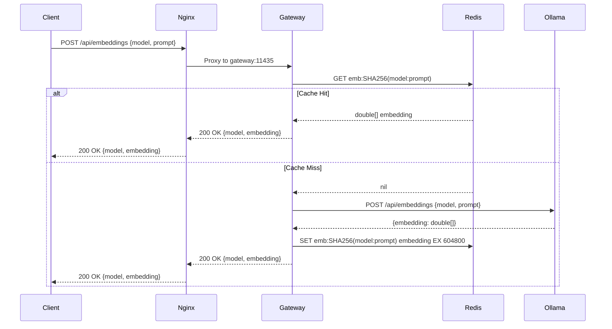

# План реализации: ASP.NET Core Gateway с Redis кэшем для Embeddings

## Обзор проекта

Задача: Добавить ASP.NET Core Gateway как кэш-слой для embedding запросов к Ollama. Gateway проверяет Redis кэш перед отправкой запроса в Ollama, что ускоряет повторные запросы.

### Текущая архитектура

```
Client → Nginx (:11434, :6333, :6334) → Ollama / Qdrant напрямую
```

### Целевая архитектура

```
Client → Nginx (:11434, :6333, :6334)
              ├── /api/embed, /api/embeddings → Gateway (:11435) → Redis → Ollama
              ├── /api/chat, /api/generate → Ollama напрямую
              └── Qdrant REST/gRPC → Qdrant напрямую
```

---

## 1. Стек технологий

| Компонент | Версия | Назначение |
|-----------|--------|------------|
| Nginx | 1.28.1-alpine | Reverse proxy, единственная точка входа |
| ASP.NET Core | 8.0 LTS | Gateway с кэш-логикой |
| Redis | 8.6.2-alpine | Кэш для embeddings (TTL 7 дней) |
| Ollama | 0.13.5 | Embedding генерация |
| Qdrant | v1.16.2 | Vector database (без изменений) |

---

## 2. Структура проекта

### 2.1 Существующий проект (без изменений, кроме docker-compose и nginx.conf)

```
qdrant-ollama-docker-cfg/pr-core-train-to-ollama-qdrant/
├── docker-compose.yml              # Обновлённый compose с Gateway + Redis
├── nginx/
│   └── nginx.conf                  # Обновлённая маршрутизация
└── qdrant/
    └── config.yaml                 # Без изменений
```

### 2.2 Новый проект Gateway (отдельная папка)

```
qdrant-ollama-docker-cfg/pr-gateway-to-ollama-qdrant/
├── src/
│   └── EmbeddingGateway/
│       ├── Program.cs              # Entry point, minimal API
│       ├── appsettings.json        # Конфигурация
│       ├── Models/
│       │   ├── EmbedRequest.cs     # Запрос embedding
│       │   ├── EmbedResponse.cs    # Ответ embedding
│       │   └── GatewaySettings.cs  # Настройки Gateway
│       ├── Services/
│       │   ├── IEmbeddingCache.cs      # Интерфейс кэша
│       │   ├── RedisEmbeddingCache.cs  # Redis реализация
│       │   ├── IOllamaService.cs       # Интерфейс Ollama
│       │   └── OllamaService.cs        # Ollama HTTP клиент
│       └── Endpoints/
│           └── EmbeddingEndpoints.cs   # /api/embed, /api/embeddings
├── EmbeddingGateway.csproj         # Project file
└── Dockerfile                      # Multi-stage build
```

---

## 3. Маршрутизация Nginx

### 3.1 Обновлённый nginx.conf

```nginx
events {
    worker_connections 1024;
}

http {
    access_log off;
    error_log /dev/stderr warn;

    # Backend upstreams
    upstream gateway_backend {
        server gateway:11435;
    }

    upstream ollama_backend {
        server ollama:11434;
    }

    upstream qdrant_backend {
        server qdrant:6333;
    }

    # === Ollama API (порт 11434) ===
    server {
        listen 11434;
        server_name localhost;

        # Embedding запросы → Gateway (кэш)
        location /api/embed {
            proxy_pass http://gateway_backend;
            proxy_set_header Host $host;
            proxy_set_header X-Real-IP $remote_addr;
            proxy_set_header X-Forwarded-For $proxy_add_x_forwarded_for;
            proxy_set_header X-Forwarded-Proto $scheme;

            proxy_read_timeout 180s;
            proxy_send_timeout 180s;
            proxy_connect_timeout 180s;
        }

        location /api/embeddings {
            proxy_pass http://gateway_backend;
            proxy_set_header Host $host;
            proxy_set_header X-Real-IP $remote_addr;
            proxy_set_header X-Forwarded-For $proxy_add_x_forwarded_for;
            proxy_set_header X-Forwarded-Proto $scheme;

            proxy_read_timeout 180s;
            proxy_send_timeout 180s;
            proxy_connect_timeout 180s;
        }

        # Chat/Generate → Ollama напрямую
        location /api/chat {
            proxy_pass http://ollama_backend;
            proxy_set_header Host $host;
            proxy_set_header X-Real-IP $remote_addr;
            proxy_set_header X-Forwarded-For $proxy_add_x_forwarded_for;
            proxy_set_header X-Forwarded-Proto $scheme;

            proxy_http_version 1.1;
            proxy_set_header Connection '';
            proxy_cache_bypass $http_upgrade;
            proxy_buffering off;
            proxy_request_buffering off;

            proxy_read_timeout 300s;
            proxy_send_timeout 300s;
        }

        location /api/generate {
            proxy_pass http://ollama_backend;
            proxy_set_header Host $host;
            proxy_set_header X-Real-IP $remote_addr;
            proxy_set_header X-Forwarded-For $proxy_add_x_forwarded_for;
            proxy_set_header X-Forwarded-Proto $scheme;

            proxy_http_version 1.1;
            proxy_set_header Connection '';
            proxy_cache_bypass $http_upgrade;
            proxy_buffering off;
            proxy_request_buffering off;

            proxy_read_timeout 300s;
            proxy_send_timeout 300s;
        }

        # Остальные Ollama endpoints → напрямую
        location / {
            proxy_pass http://ollama_backend;
            proxy_set_header Host $host;
            proxy_set_header X-Real-IP $remote_addr;
            proxy_set_header X-Forwarded-For $proxy_add_x_forwarded_for;
            proxy_set_header X-Forwarded-Proto $scheme;

            proxy_read_timeout 180s;
            proxy_send_timeout 180s;
            proxy_connect_timeout 180s;
        }
    }

    # === Qdrant API (порт 6333) ===
    server {
        listen 6333;
        server_name localhost;

        location / {
            proxy_pass http://qdrant_backend;
            proxy_set_header Host $host;
            proxy_set_header X-Real-IP $remote_addr;
            proxy_set_header X-Forwarded-For $proxy_add_x_forwarded_for;
            proxy_set_header X-Forwarded-Proto $scheme;

            proxy_buffering on;
        }

        location /dashboard/ {
            proxy_pass http://qdrant_backend/dashboard/;
            proxy_set_header Host $host;
            proxy_set_header X-Real-IP $remote_addr;
        }
    }

    # === Qdrant gRPC (порт 6334) ===
    server {
        listen 6334 http2;
        server_name localhost;

        location / {
            grpc_pass grpc://qdrant:6334;
            grpc_set_header X-Real-IP $remote_addr;
            grpc_set_header X-Forwarded-For $proxy_add_x_forwarded_for;
            grpc_set_header X-Forwarded-Proto $scheme;

            grpc_read_timeout 600s;
            grpc_send_timeout 600s;
            grpc_socket_keepalive on;
        }
    }
}
```

---

## 4. ASP.NET Core Gateway реализация

### 4.1 Program.cs

```csharp
using EmbeddingGateway.Services;
using EmbeddingGateway.Endpoints;

var builder = WebApplication.CreateBuilder(args);

// Configuration
builder.Services.Configure<GatewaySettings>(
    builder.Configuration.GetSection("Gateway"));

// Redis
builder.Services.AddSingleton<IEmbeddingCache, RedisEmbeddingCache>();

// Ollama HTTP Client
builder.Services.AddHttpClient<IOllamaService, OllamaService>(client =>
{
    client.BaseAddress = new Uri(builder.Configuration["Gateway:OllamaBaseUrl"]);
    client.Timeout = TimeSpan.FromMinutes(3);
});

var app = builder.Build();

// Endpoints
app.MapPost("/api/embed", EmbeddingEndpoints.HandleEmbed);
app.MapPost("/api/embeddings", EmbeddingEndpoints.HandleEmbeddings);

// Health check
app.MapGet("/health", () => Results.Ok(new { status = "healthy" }));

app.Run();
```

### 4.2 Модели

```csharp
// Models/EmbedRequest.cs
public record EmbedRequest(string Model, string Prompt);

// Models/EmbedResponse.cs
public record EmbedResponse(string Model, double[] Embedding);

// Models/GatewaySettings.cs
public class GatewaySettings
{
    public string OllamaBaseUrl { get; set; } = "http://ollama:11434";
    public string RedisHost { get; set; } = "redis";
    public int RedisPort { get; set; } = 6379;
    public int CacheTtlHours { get; set; } = 168; // 7 дней
}
```

### 4.3 Redis кэш сервис

```csharp
// Services/RedisEmbeddingCache.cs
public class RedisEmbeddingCache : IEmbeddingCache
{
    private readonly IDatabase _db;
    private readonly TimeSpan _ttl;

    public RedisEmbeddingCache(IConnectionMultiplexer redis, GatewaySettings settings)
    {
        _db = redis.GetDatabase();
        _ttl = TimeSpan.FromHours(settings.CacheTtlHours);
    }

    public async Task<double[]?> GetAsync(string model, string prompt)
    {
        var key = GenerateCacheKey(model, prompt);
        var json = await _db.StringGetAsync(key);
        return json.HasValue ? JsonSerializer.Deserialize<double[]>(json!) : null;
    }

    public async Task SetAsync(string model, string prompt, double[] embedding)
    {
        var key = GenerateCacheKey(model, prompt);
        var json = JsonSerializer.Serialize(embedding);
        await _db.StringSetAsync(key, json, _ttl);
    }

    private static string GenerateCacheKey(string model, string prompt)
    {
        var input = $"{model}:{prompt}";
        var hash = SHA256.HashData(Encoding.UTF8.GetBytes(input));
        return $"emb:{Convert.ToHexString(hash)}";
    }
}
```

### 4.4 Ollama сервис

```csharp
// Services/OllamaService.cs
public class OllamaService : IOllamaService
{
    private readonly HttpClient _httpClient;

    public OllamaService(HttpClient httpClient)
    {
        _httpClient = httpClient;
    }

    public async Task<double[]> GetEmbeddingAsync(string model, string prompt)
    {
        var request = new { model, prompt };
        var response = await _httpClient.PostAsJsonAsync("/api/embeddings", request);
        response.EnsureSuccessStatusCode();

        var result = await response.Content.ReadFromJsonAsync<OllamaEmbedResponse>();
        return result!.Embedding;
    }

    private record OllamaEmbedResponse(double[] Embedding);
}
```

### 4.5 Endpoints

```csharp
// Endpoints/EmbeddingEndpoints.cs
public static class EmbeddingEndpoints
{
    public static async Task<IResult> HandleEmbed(
        EmbedRequest request,
        IEmbeddingCache cache,
        IOllamaService ollama)
    {
        // 1. Проверить кэш
        var cached = await cache.GetAsync(request.Model, request.Prompt);
        if (cached != null)
        {
            return Results.Ok(new EmbedResponse(request.Model, cached));
        }

        // 2. Запросить Ollama
        var embedding = await ollama.GetEmbeddingAsync(request.Model, request.Prompt);

        // 3. Сохранить в кэш
        await cache.SetAsync(request.Model, request.Prompt, embedding);

        // 4. Вернуть ответ
        return Results.Ok(new EmbedResponse(request.Model, embedding));
    }

    public static async Task<IResult> HandleEmbeddings(
        EmbedRequest request,
        IEmbeddingCache cache,
        IOllamaService ollama)
    {
        // Аналогично HandleEmbed
        return await HandleEmbed(request, cache, ollama);
    }
}
```

---

## 5. Docker конфигурация

### 5.1 Dockerfile

Файл: `qdrant-ollama-docker-cfg/pr-gateway-to-ollama-qdrant/Dockerfile`

```dockerfile
FROM mcr.microsoft.com/dotnet/sdk:8.0 AS build
WORKDIR /src
COPY ["EmbeddingGateway.csproj", "."]
RUN dotnet restore
COPY . .
RUN dotnet publish -c Release -o /app/publish /p:UseAppHost=false

FROM mcr.microsoft.com/dotnet/aspnet:8.0 AS final
WORKDIR /app
COPY --from=publish /app/publish .
EXPOSE 11435
ENV ASPNETCORE_URLS=http://+:11435
ENTRYPOINT ["dotnet", "EmbeddingGateway.dll"]
```

### 5.2 Обновлённый docker-compose.yml

Файл: `qdrant-ollama-docker-cfg/pr-core-train-to-ollama-qdrant/docker-compose.yml`

```yaml
services:
  ollama:
    image: ollama/ollama:0.13.5
    container_name: ollama
    volumes:
      - ollama:/root/.ollama
    environment:
      - OLLAMA_HOST=0.0.0.0
      - OLLAMA_NUM_PARALLEL=1
      - OLLAMA_MAX_LOADED_MODELS=1
      - OLLAMA_GPU_LAYERS=0
      - OLLAMA_NUM_THREADS=4
      - OLLAMA_MAX_QUEUE=1024
      - OLLAMA_KEEP_ALIVE="2h"
      - OLLAMA_DEBUG=false
    networks:
      - internal
    restart: unless-stopped

  qdrant:
    image: qdrant/qdrant:v1.16.2
    container_name: qdrant
    volumes:
      - qdrant_storage:/qdrant/storage
      - ./qdrant/config.yaml:/qdrant/config/production.yaml:ro
    command: ./qdrant --config-path /qdrant/config/production.yaml
    environment:
      - QDRANT__STORAGE__STORAGE_PATH=/qdrant/storage
      - QDRANT__SERVICE__HTTP_PORT=6333
      - QDRANT__SERVICE__GRPC_PORT=6334
      - QDRANT__SERVICE__ENABLE_CORS=true
      - QDRANT__STORAGE__SNAPSHOTS_PATH=/qdrant/snapshots
      - QDRANT__TELEMETRY_DISABLED=true
    networks:
      - internal
    restart: unless-stopped

  redis:
    image: redis:8.6.2-alpine
    container_name: redis-cache
    command: redis-server --maxmemory 256mb --maxmemory-policy allkeys-lru
    networks:
      - internal
    restart: unless-stopped

  gateway:
    build:
      context: ../pr-gateway-to-ollama-qdrant
      dockerfile: Dockerfile
    container_name: embedding-gateway
    environment:
      - Gateway__OllamaBaseUrl=http://ollama:11434
      - Gateway__RedisHost=redis
      - Gateway__RedisPort=6379
      - Gateway__CacheTtlHours=168
    depends_on:
      - ollama
      - redis
    networks:
      - internal
    restart: unless-stopped

  nginx:
    image: nginx:1.28.1-alpine
    container_name: nginx-proxy
    ports:
      - "11434:11434"
      - "6333:6333"
      - "6334:6334"
    volumes:
      - ./nginx/nginx.conf:/etc/nginx/nginx.conf:ro
    depends_on:
      - ollama
      - qdrant
      - gateway
    networks:
      - internal
    restart: unless-stopped

volumes:
  ollama:
  qdrant_storage:

networks:
  internal:
    driver: bridge
```

---

## 6. Порядок реализации (Todo List)

### Phase 1: Инфраструктура (Docker)
- [ ] 1.1 Добавить Redis сервис в docker-compose.yml
- [ ] 1.2 Добавить Gateway сервис в docker-compose.yml
- [ ] 1.3 Обновить nginx.conf для маршрутизации embedding запросов на Gateway
- [ ] 1.4 Создать директорию `gateway/` с Dockerfile

### Phase 2: ASP.NET Core Gateway проект
- [ ] 2.1 Создать solution и проект EmbeddingGateway.csproj
- [ ] 2.2 Создать Program.cs с минимальной конфигурацией
- [ ] 2.3 Создать appsettings.json с настройками
- [ ] 2.4 Добавить NuGet пакеты: StackExchange.Redis, Microsoft.Extensions.Http

### Phase 3: Модели и интерфейсы
- [ ] 3.1 Создать Models/EmbedRequest.cs
- [ ] 3.2 Создать Models/EmbedResponse.cs
- [ ] 3.3 Создать Models/GatewaySettings.cs
- [ ] 3.4 Создать Services/IEmbeddingCache.cs
- [ ] 3.5 Создать Services/IOllamaService.cs

### Phase 4: Реализация сервисов
- [ ] 4.1 Реализовать Services/RedisEmbeddingCache.cs (SHA256 key, TTL 7 дней)
- [ ] 4.2 Реализовать Services/OllamaService.cs (HTTP клиент)

### Phase 5: Endpoints
- [ ] 5.1 Создать Endpoints/EmbeddingEndpoints.cs
- [ ] 5.2 Реализовать /api/embed endpoint (cache → ollama → cache)
- [ ] 5.3 Реализовать /api/embeddings endpoint (аналогично)
- [ ] 5.4 Добавить /health endpoint

### Phase 6: Тестирование
- [ ] 6.1 Запустить стек: `docker-compose up -d`
- [ ] 6.2 Проверить health endpoint: `curl http://localhost:11434/health`
- [ ] 6.3 Тест embedding запроса (первый вызов → Ollama)
- [ ] 6.4 Тест кэша (повторный вызов → Redis)
- [ ] 6.5 Проверить Redis ключи: `docker exec redis-cache redis-cli KEYS "*"`

---

## 7. Диаграмма последовательности



---

## 8. Формат кэш ключа

```
Key: emb:{SHA256(model:prompt)}
TTL: 604800 секунд (7 дней)
Value: JSON массив double[]
```

Пример:
```
Input: model="nomic-embed-text", prompt="Hello world"
Key: emb:A1B2C3D4E5F6... (SHA256 hex)
Value: [0.123, -0.456, 0.789, ...]
```

---

## 9. Redis конфигурация

```
maxmemory: 256mb
maxmemory-policy: allkeys-lru (удалять наименее используемые при нехватке)
```

---

## 10. API совместимость

Gateway полностью совместим с Ollama API для embedding endpoints:

### Request format
```json
{
  "model": "nomic-embed-text",
  "prompt": "Hello world"
}
```

### Response format
```json
{
  "model": "nomic-embed-text",
  "embedding": [0.123, -0.456, 0.789, ...]
}
```

Клиент не замечает разницы между прямым запросом к Ollama и запросом через Gateway.
